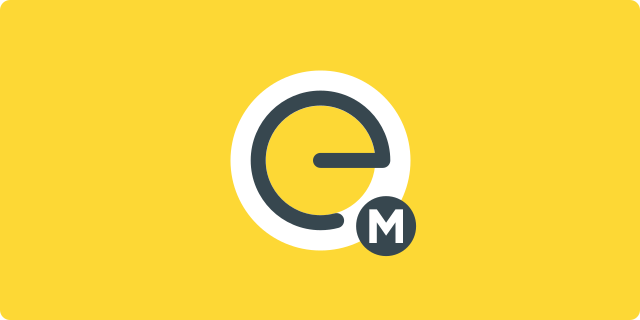

### INTRODUCTION

**Mini Elementarium** is an progressive web application about the elements of the periodic table, with a colorful, intuitive and multi linguistic interface for various devices.

### FEATURES

**Responsive** - The application is designed to support various screen sizes.

**multi linguistic** - A set of languages is available to facilitate access to content.

**intuitive** - The entire interface has been designed to give the user an easy and intuitive experience.

### GETTING STARTED

The application can be accessed by the address [`mini-elementarium.tk`](http://mini-elementarium.tk) or [`FelixLuciano.github.io/mini-elementarium`](https://felixluciano.github.io/mini-elementarium).
This is a progressive web application, this means that it can be installed on your device directly from your browser for offline access from your desktop or home screen.

### TRANSLATIONS AVAILABLE

- [English](https://github.com/FelixLuciano/mini-elementarium/issues/2)
- [Spanish](https://github.com/FelixLuciano/mini-elementarium/issues/5)
- [Portuguese](https://github.com/FelixLuciano/mini-elementarium/issues/3)
- [Russian](https://github.com/FelixLuciano/mini-elementarium/issues/4)

You can contribute to the translation of this application by [creating a issue](https://github.com/FelixLuciano/mini-elementarium/issues/new?&labels=Language+request&template=language-request.md) or commenting on [issues already created](https://github.com/FelixLuciano/mini-elementarium/issues?q=is%3Aopen+is%3Aissue+label%3A%22Language+request%22).

### LICENSE
[MIT](https://github.com/FelixLuciano/mini-elementarium/blob/master/LICENSE)

**Copyright (c) 2023 Luciano Felix**
